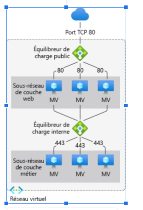

### Contexte projet 

Les administrateurs Cloud de Prodigy Software déploient une architecture hautement disponible avec équilibreur de charge public/privé pour Global Logistics Group, garantissant performances et fiabilité

### Livrables

- Une infrastructure déployé en ias

- Une sous-couche web soit un serveur nginx ou apache

- Une sous-couche tiers 